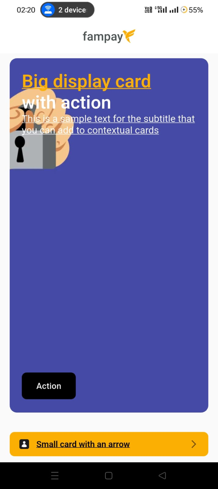
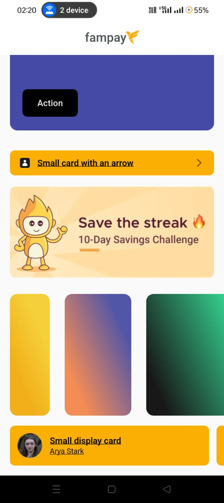

# Contextual Card Flutter

A Flutter application that displays contextual cards with various design types, supporting formatted text, images, gradients, and interactive actions. This app fetches card data from an API and renders different card layouts based on the design specifications.

## Screenshots

 

## Features

- **Multiple Card Types**: Support for 5 different card design types (HC1, HC3, HC5, HC6, HC9)
- **Formatted Text**: Rich text formatting with custom colors, fonts, and clickable entities
- **Interactive Actions**: Deep linking, CTA buttons, and card dismissal
- **Card Management**: Dismiss cards permanently or remind later functionality
- **Gradient Backgrounds**: Support for custom gradient backgrounds with angle control
- **Image Handling**: Network images with caching and error handling
- **Responsive Design**: Adaptive layouts for different screen sizes
- **Pull to Refresh**: Refresh card data with pull-to-refresh gesture

## Architecture

The project follows a clean architecture pattern with clear separation of concerns:

```
lib/
├── main.dart                          # App entry point
├── models/                            # Data models
│   └── card_models.dart              # Card, CardGroup, and related models
├── services/                          # External services
│   ├── api_service.dart              # API communication
│   └── storage_services.dart         # Local storage for dismissed cards
├── utils/                            # Utility functions
│   ├── card_utils.dart               # Card-related utilities
│   ├── color_utils.dart              # Color parsing and gradient creation
│   └── text_utils.dart               # Formatted text rendering
└── widgets/                          # UI components
    ├── contextual_cards_container.dart # Main container for cards
    └── card_widgets/                 # Individual card widgets
        ├── hc1_small_display_card.dart
        ├── hc3_big_display_card.dart
        ├── hc5_image_card.dart
        ├── hc6_small_card_with_arrow.dart
        └── hc9_dynamic_width_card.dart
```

## Card Types

### HC1 - Small Display Card
- Displays an icon, title, and description
- Used for simple information display
- Fixed width of 320px when in scrollable containers

### HC3 - Big Display Card
- Large card with background image/gradient
- Supports formatted title and CTA buttons
- Interactive features: long press to reveal action buttons
- Actions: "Remind Later" and "Dismiss Now"

### HC5 - Image Card
- Full-width image display
- Simple tap-to-action functionality
- Primarily used for visual content

### HC6 - Small Card with Arrow
- Compact card with icon, text, and arrow indicator
- Used for navigation or quick actions
- Custom background colors

### HC9 - Dynamic Width Card
- Width calculated based on image aspect ratio
- Gradient background support
- Used in horizontal scrollable containers

## Data Flow

1. **App Initialization**: App starts and loads the main container
2. **API Call**: Fetch contextual cards from the FamPay API endpoint
3. **Data Parsing**: JSON response is parsed into CardGroup and ContextualCard models
4. **Filtering**: Cards are filtered based on dismissal status and remind-later preferences
5. **Rendering**: Cards are grouped and rendered based on their design types
6. **User Interaction**: Handle taps, long presses, and swipe actions
7. **State Management**: Update local storage for dismissed/remind-later cards

## API Structure

The app consumes a REST API that returns card groups with the following structure:

- **Card Group**: Container for multiple cards with design type and layout properties
- **Contextual Card**: Individual card with content, styling, and action properties
- **Formatted Text**: Rich text with entities for custom styling and links
- **Text Entity**: Styled text segments with colors, fonts, and URLs
- **Card Image**: Image references (external URLs or assets)
- **Gradient**: Color gradients with angle specifications
- **Call to Action**: Button definitions with styling and actions

## Key Components

### TextUtils
Handles formatted text rendering with support for:
- Placeholder replacement (`{}` patterns)
- Custom text styling (colors, fonts, decorations)
- Clickable text entities with deep linking
- Fallback text handling

### ColorUtils
Manages color operations:
- Hex color parsing with transparency support
- Gradient creation with angle calculations
- Color validation and fallbacks

### CardUtils
Provides card-related functionality:
- Deep link handling for URLs
- Card-specific padding and border radius
- External URL launching

### StorageService
Manages local persistence:
- Dismissed cards tracking
- Remind-later functionality
- SharedPreferences integration

## User Interactions

### Big Display Cards (HC3)
- **Tap**: Open deep link or perform default action
- **Long Press**: Reveal action buttons (slide animation)
- **Remind Later**: Hide card temporarily (cleared on app restart)
- **Dismiss Now**: Permanently remove card from view

### General Cards
- **Tap**: Execute card's primary action or deep link
- **Pull to Refresh**: Reload all card data from API

## Dependencies

- `flutter/material.dart` - UI framework
- `http` - API communication
- `shared_preferences` - Local storage
- `cached_network_image` - Image loading and caching
- `url_launcher` - Deep link handling
- `flutter_svg` - SVG asset support

## Setup and Installation

1. **Clone the repository**
2. **Install dependencies**: `flutter pub get`
3. **Run the app**: `flutter run`

## API Endpoint

The app fetches data from:
```
https://polyjuice.kong.fampay.co/mock/famapp/feed/home_section/?slugs=famx-paypage
```

## Error Handling

- Network errors with retry functionality
- Image loading errors with placeholder fallbacks
- Invalid color/URL handling with defaults
- Graceful degradation for missing data fields

## Future Enhancements

- Offline support with cached data
- More card design types
- Enhanced animations and transitions
- Advanced text formatting options
- Custom theme support
